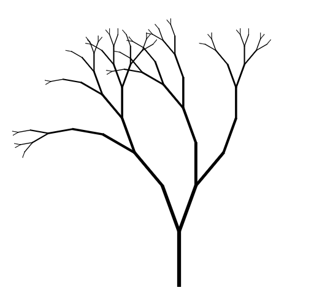
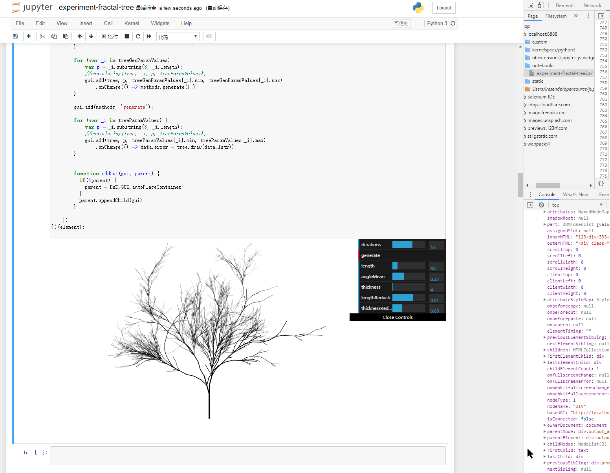

# Viz Inspired by Nature

Experiments on viz. Following image shows a simple tree generated by fractal tree algorithm.

Experiments with L-System tree generation.

([Go Interactive](https://nbviewer.jupyter.org/github/wenoptics/viz-by-nature/blob/1dc5e94ada2a0aaf06f77c4a36e665353b0155ad/experiment-fractal-tree.ipynb))

This is, for sure, produces very PRIMITIVE result. However this notebook can be served as a proof-of-concept for leveraging modern frontend technologies for viz experiments (in this case, canvas + javascript + [dat.gui](http://workshop.chromeexperiments.com/examples/gui/#1--Basic-Usage)). I feel excited and promising about this path since such workflow really powerful and opens flexibily, enables fast-prototyping and presents _[Ling](https://lingfeiwu.github.io/)'s viz dictionary idea_ in a good way - think of each interactable value can be driven by real data.

## Roadmap

todo

## References

todo

