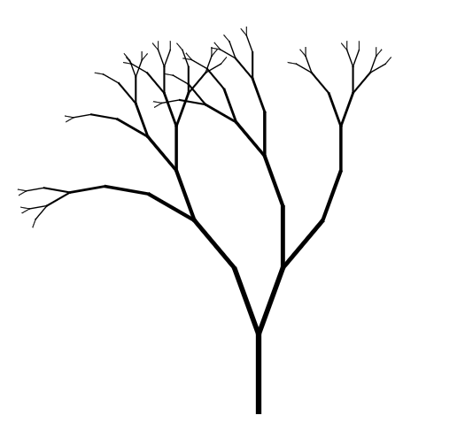

# Viz Inspired by Nature

Experiments on viz. Following image shows a demo tree generated by `fractal tree` algorithm. 

([Go Interactive](https://nbviewer.jupyter.org/github/wenoptics/viz-by-nature/blob/a1d731083f2bd06163cb9831f25ff263c8a23e44/experiment-fractal-tree.ipynb))

